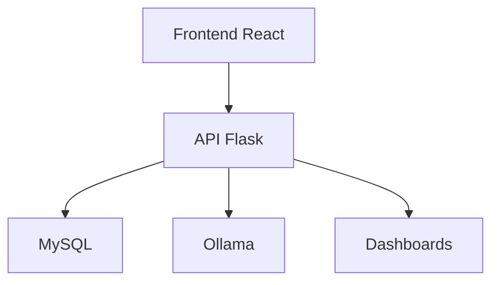

# 🏆 Marketplace Tarragona  
**Ganador del Hackathon TechTalent 2024**

> 🌿 Plataforma de comercio local impulsada por IA  
> 🎯 Conecta productores de Tarragona con consumidores  
> ⚙️ Basado en React, Flask, MySQL, y Ollama

---

## 🚀 ¿Qué es Marketplace Tarragona?

**Marketplace Tarragona** es una plataforma digital creada para empoderar a los productores locales de Tarragona. Combina un e-commerce moderno con inteligencia artificial, dashboards interactivos y funcionalidades pensadas tanto para compradores como vendedores.

🎉 **Premiado como el mejor proyecto en el Hackathon TechTalent 2024**

---

## 🟝️ Demo Rápida

### 🎮 Instalación del Proyecto  


### 🧭 Navegación Completa de la App  


---

## 🔥 Lo Más Destacado

| Clientes | Vendedores | IA & Analytics |
|---------|------------|----------------|
| 🛍️ Catálogo con filtros avanzados | 📦 Panel de gestión completo | 🤖 Chatbot con IA local (Ollama) |
| 🧾 Historial de compras | 🔔 Alertas de stock | 📊 Dashboards interactivos |
| 🧑 Perfil personalizado | 📈 Estadísticas en tiempo real | 🧠 NLP y respuestas contextuales |

---

## 🏅 Por Qué Ganamos el Hackathon

✅ Solución real a una necesidad local  
✅ Integración técnica avanzada con IA  
✅ App funcional 100% end-to-end  
✅ Interfaz moderna y responsiva  
✅ Escalable y fácil de mantener  

---

## 🧱 Tecnologías Clave

### Frontend
- React 18.3.1 + Vite
- TypeScript 5.5.3
- TailwindCSS + Radix UI
- TanStack Query

### Backend
- Flask + Python 3.13
- MySQL 8.0
- Ollama (LLM local)
- Flask-BCrypt + Marshmallow

### Visualización & Otros
- Swagger UI (docs)
- Power BI (dashboards)
- Recharts (gráficos)
- .env config + scripts de base de datos

---

## 🧠 Chatbot Inteligente

**Capacidades**  
- 🌍 Búsqueda inteligente por intención  
- 📦 Interacción con pedidos/productos  
- 📊 Estadísticas por voz o texto  
- ⚡ Respuesta en menos de 1 minuto con Ollama

**Consultas que puedes hacer**
```
"¿Tienes manzanas en stock?"
"¡Muéstrame productos sin alérgenos"
"¿Cuántos pedidos hay pendientes?"
"¿Qué productos son los más populares?"
```

**Endpoints**
- `POST /chatbot/query`
- `GET /chatbot/products/{tipo}`
- `POST /chatbot/create-order`

---

## 📊 Analytics y Panel Admin

🎯 Dashboards con métricas clave:
- Total de ventas y usuarios
- Productos más vendidos
- Estado de pedidos
- Stock bajo y alertas

📌 Herramientas:
- Recharts en frontend
- Power BI para análisis externo
- Exportación y filtros por usuario

---

## 🏗️ Arquitectura General



**Flujo**: React → Flask → MySQL + IA + Power BI  
**Estado Global**: TanStack Query + React Context  
**Modularidad**: Separación clara de servicios y modelos

---

## ⚙️ Instalación Paso a Paso

### Requisitos
- Python 3.13+, Node.js 18+, MySQL 8.0+, Ollama instalado

### 1. Clonar el Proyecto
```bash
git clone https://github.com/tu-usuario/marketplace-tarragona.git
cd marketplace-tarragona
```

### 2. Backend
```bash
cd Backend
pip install -r requirements.txt
cp .env.example .env   # Configura tus credenciales
mysql -u root -p < "Base de datos v1.sql"
python run.py
```

### 3. Frontend
```bash
cd Frontend
npm install
npm run dev
```

### 4. Chatbot (Ollama)
```bash
ollama pull llama2
curl http://localhost:11434/api/tags
```

🧷 Accede:
- http://localhost:5173 (Frontend)
- http://localhost:5000 (Backend)
- http://localhost:5000/docs (Swagger)

---

## 📱 Funcionalidades en Detalle

### 🎯 Público General
- Navegación por categorías
- Búsqueda avanzada (origen, alérgenos)
- Carrito persistente y checkout
- Registro/login seguro
- Historial y perfil personalizado

### 🛍️ Vendedores
- Gestión de productos y stock
- Alertas automáticas
- Pedidos en tiempo real
- Dashboard con ventas

---

## 🔮 Futuras Mejoras

✅ App completa ya funcional  
📌 Estas son las mejoras previstas:

### Funciones Nuevas
- App móvil (React Native)
- Reseñas y valoraciones
- Pagos integrados (Stripe/PayPal)
- Geolocalización y notificaciones

### Mejoras IA
- Recomendaciones personalizadas
- Análisis de sentimientos
- Chat por voz
- Predicción de demanda

### Analytics Avanzado
- Dashboards por usuario
- Alertas automáticas
- Integración con Google Analytics

---

## 👥 Créditos y Reconocimientos

**Equipo ganador del Hackathon TechTalent Tarragona 2024**  
Gracias a:
- TechTalent y Ayuntamiento de Tarragona
- Comunidad local de productores
- Mentores y jurado del evento

---

## 🤝 Cómo Contribuir

```bash
# Haz un fork y crea una rama
git checkout -b feature/TuFeature
git commit -m "Agrega X"
git push origin feature/TuFeature
# Abre un Pull Request 🚀
```

---

## 📄 Licencia

Este proyecto está bajo la Licencia MIT.  
Consulta el archivo `LICENSE` para más información.

---

<div align="center">
  
🔗 [Volver al inicio](#-marketplace-tarragona)  
🚀 *Impulsando la economía local con tecnología e innovación*  
🏆 *Ganador Hackathon TechTalent 2024*

</div>

